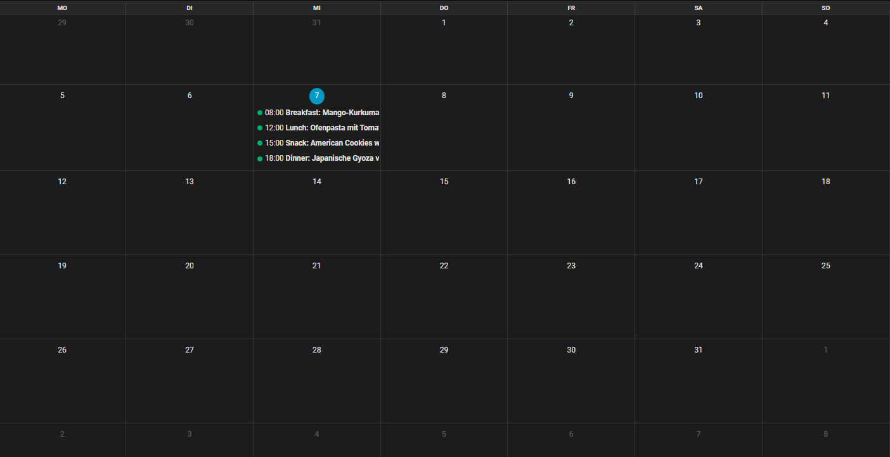
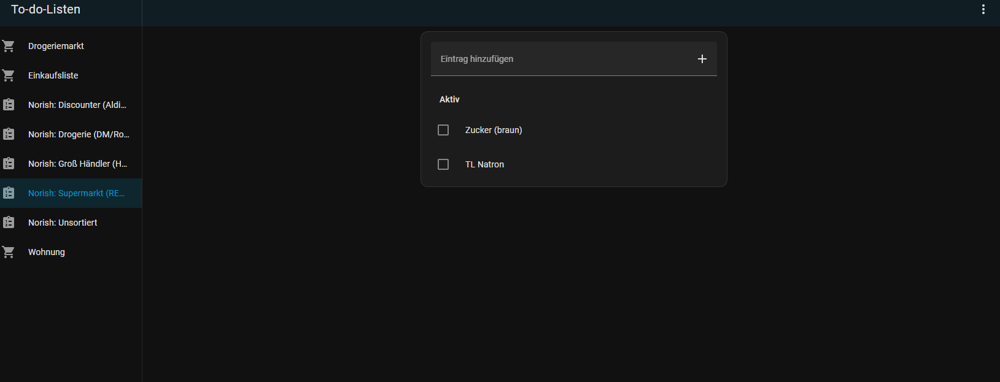
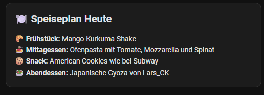

# hass-norish
# Norish Integration for Home Assistant

Bring your [Norish](https://github.com/norish-recipes/norish) recipe manager directly into your smart home! This integration connects your self-hosted Norish instance with Home Assistant to streamline meal planning and grocery shopping for families and friends.

[](https://hacs.xyz/)

## ✨ Key Features

* **📅 Meal Plan Calendar:** Syncs your Norish meal schedule directly to the Home Assistant calendar component.
* **🛒 Grocery List Sync:** Integrates Norish shopping lists as native Home Assistant `todo` entities.
* **🍽️ "What's for Dinner?":** Dedicated sensors to display today's meal, including titles and recipe details on your dashboard.
* **🚀 Automation Ready:** Use your meal plan to trigger notifications (e.g., "Don't forget to take the meat out of the freezer for tonight's recipe").

---

## 📸 Visuals

### Calendar & Todo
<p align="center">
  
  
</p>

### Today's Menu Dashboard
You can use a **Markdown Card** to display your meals for today:



**Card Code:**
```yaml
type: markdown
content: >
  ## 🍽️ Speiseplan Heute

  
   
  
  **🥐 Frühstück:**
  {{ state_attr(sensor, 'breakfast') | join(', ') }}
  

  
  **🍝 Mittagessen:**
  {{ state_attr(sensor, 'lunch') | join(', ') }}
  

  
  **🍪 Snack:**
  {{ state_attr(sensor, 'snack') | join(', ') }}
  

  
  **🥗 Abendessen:**
  {{ state_attr(sensor, 'dinner') | join(', ') }}
  

  
  *Heute steht noch nichts auf dem Plan.*
  
```

## 🛠 Installation

### Option 1: HACS (Recommended)
Ensure HACS is installed.

Go to HACS > Integrations > 3-dot menu > Custom repositories.

Paste: https://github.com/Caps3n/hass-norish

Select Integration and click Add.

Restart Home Assistant.

### Option 2: Manual Installation
Download the norish folder from custom_components/.

Copy the folder into your Home Assistant /config/custom_components/ directory.

Restart Home Assistant.

## ⚙️ Configuration
You will need:
* The **URL** of your Norish instance (e.g., `http://192.168.1.50:8080`)
* Your **API Token** (found in your Norish user settings)

## 🗺️ Roadmap


---
*Developed by @Caps3n. This project is an independent integration and is not officially affiliated with the core Norish development team.*
